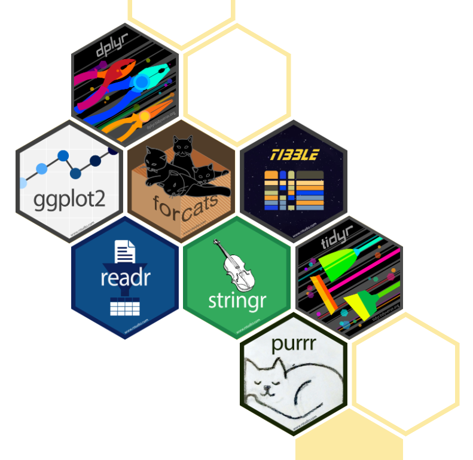
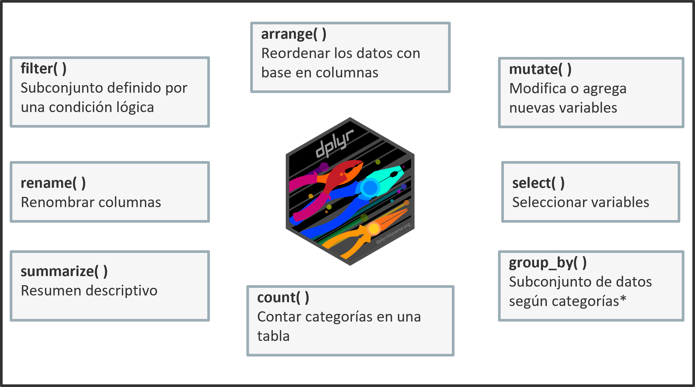

```{r setup, include=FALSE}
knitr::opts_chunk$set(echo = FALSE,warning = FALSE, message = FALSE)
def.chunk.hook  <- knitr::knit_hooks$get("chunk")
knitr::knit_hooks$set(chunk = function(x, options) {
  x <- def.chunk.hook(x, options)
  paste0("\n \\", "tiny","\n\n", x, "\n\n \\normalsize")
})


```

```{r , echo=F, warning=F, message=F}
library(tibble)
library (kableExtra)
library(plyr)
library(tidyverse)
library(reshape2)
```


# Paquetes en R

Los paquetes en R son colecciones de funciones, datos y documentación cuyo objetivo es  extender las capacidades básicas de R. **CRAN** (The Comprehensive R Archive Network) es una red de servidores que almacenan versiones de R, así como librerías en R que cumplen las políticas del repositorio \textcolor{cyan}{(CRAN, 2022)}.

Para instalar paquetes del repositorio **CRAN**:
  
```{r, echo=TRUE, eval = F}
install.packages(“dplyr”)
```

Después de instalar el paquete, se debe cargar la librería:

```{r, echo=TRUE, eval = F}
library(dplyr)
```

Para encontrar la documentación del paquete:
  
```{r, echo=TRUE, eval = F}
help(dplyr)
```

## Tidyverse

::: columns
::: {.column width="50%"}

\bigskip

\bigskip

\bigskip

**Tidyverse** es un conjunto de librerías en R diseñadas para el análisis de datos (importar, transforma, visualizar y modelar con datos) (Wickham, 2019).

\bigskip

Nos concentraremos en las siguientes librerías:
  
- dplyr
- ggplot2
- forcats*
  
:::
  
::: {.column width="50%"}

:::
:::
  
# Importar datos
  
El primer paso es definir el directorio de trabajo:
  
```{r, echo=TRUE, eval=F}
setwd("path")
```

Nos concentraremos en funciones para importar los siguientes formatos de datos
\begin{table}[ht]
\centering
\resizebox{11cm}{!}{
  \begin{tabular}{|*{4}{c|}}
  \hline
  \textbf{Formato} & \textbf{Formato específico}  & \textbf{Función} & \textbf{Paquete}  \\
  \hline
  Texto o tabulares & CSV   &  read\_csv()        & readr \\  
  \cline{2-4}
  &      Otros formatos de texto    &  read\_delim()   &        readr              \\ 
  \hline
  Formatos de otros programas           &  Excel         & read\_excel()           &  readxl   \\ 
  \cline{2-4}
  & SPSS   &  read\_sav()         &  haven                   \\  
  \cline{2-4}
  & STATA          &  read\_dta()         & haven                     \\  
  \cline{2-4}
  & SAS          &  read\_sas()         &   haven                   \\
  \hline
  
  Formatos propios de R          &  .rda         & load()           &  base   \\ 
  \cline{2-4}
  & .rds   &  readRDS()         &    base                 \\  
  \hline
  \hline
  \end{tabular}
}
\label{tab:multicol}
\end{table}


## Base de datos

La base de datos usada es extraída de los microdatos de la \textbf{Gran Encuesta Integrada de Hogares (GEIH)} para diciembre de 2023. El análisis considera las siguientes 13 ciudades y áreas metropolitanas:

::: columns
::: {.column width="30%"}

- Medellín A.M.
- Barranquilla A.M.
- Bogotá
- Cartagena
- Manizales A.M.


:::
  
::: {.column width="30%"}

- Monteria
- Villavicencio
- Pasto
- Cucuta A.M.
- Pereira A.M.

:::

::: {.column width="30%"}

- Pereira A.M.
- Bucaramanga A.M.
- Ibague 
- Cali A.M
:::
:::

\bigskip

La información es extraída de dos módulos de la GEIH:

- **Ocupados** (horas trabajadas , ingreso laboral, actividad económica, etc.)
- **Características generales, seguridad social en salud y educación** (edad, sexo, nivel de educación, etc.)


## Base de datos (cont.)

Para importar la base de datos (.xlsx),

```{r, echo=F, eval=T}
library(readxl)
dataset <- readxl::read_excel("C:/Users/PC/Desktop/Curso_EDA_2024_I/Datos/Formatos/geih_dataset.xlsx")
```

```{r, echo=T, eval=F}
library(readxl)
dataset <- readxl::read_excel("Datos/Formatos/geih_dataset.xlsx")
```

La siguiente tabla muestra un resumen de la base de datos:
\begin{table}[ht]
\centering
\resizebox{5.5cm}{!}{
  \begin{tabular}{lll}
  \hline
  \textbf{Variable} & \textbf{Clase}  & \textbf{Descripción}   \\
  \hline
  area & Factor & Área metropolitana \\ 
        dpto & Factor & Departamento \\ 
        sexo & Factor & Sexo al nacer \\ 
        parent & Factor & Parentesco con el jefe o jefa del hogar \\ 
        edad & Numérica & Años cumplidos \\
        edu & Factor & Mayor nivel educativo alcanzado \\ 
        ingreso & Numérica & Ingreso laboral \\ 
        horas\_semana & Numérica & Horas trabajadas normalmente a la semana \\ 
        cotiza & Factor & ¿Cotiza a un fondo de pensiones? \\ 
        lugar & Factor & Lugar principal de trabajo \\ 
        meses & Numérica & ¿Cuántos meses trabajó en los últimos 12 meses? \\ 
        rama\_4 & Cadena & Rama de actividad CIIU REV 4 (4 dígitos) \\ 
        rama\_2 & Cadena & Rama de actividad CIIU REV 4 (4 dígitos) \\ 
        posic & Factor & Posición laboral \\ 
        fondo & Factor & ¿A cuál fondo cotiza? \\ 
        cambiar & Factor & ¿Desea cambiar su trabajo? \\ 
        estable & Factor & ¿Considera que su empleo es estable? \\ 
        t\_actual & Numérica & ¿Cuánto tiempo lleva en su empleo actual? \\ 
        t\_viaje & Numérica & Tiempo de desplazamiento al trabajo \\ 
        mas\_h & Factor & ¿Quiere trabajar más horas? \\ 
        medio & Factor & Medio de transporte \\ 
        sintrab & Factor & ¿Si no tuviera trabajo, de dónde obtendría sus recursos? \\ 
        n\_comp & Factor & ¿Cuántas personas tiene la empresa donde trabajo? \\ 
        srl & Factor & ¿Afiliación a ARL? \\ 
        caja & Factor & ¿Afiliación a caja de compensación familiar? \\ 
        actividad & Factor & Actividad económica recodificada \\ 
        cotiza\_fondo & Factor & Fondo de pensiones recodificado \\ 
        factor\_exp & Numérica & Factor de expansión \\ \hline\hline
  \end{tabular}
}
\label{tab:multicol}
\end{table}


# Herramientas para la manipulación de datos


## Pipe (%>%)

La tubería de comando o *pipeline* (`%>%`) es una herramienta utilizada para el encadenamiento de funciones. El operador nos permite escribir una secuencia de operaciones

Una secuencia en su **forma estándar** sigue la forma

```{r, echo=TRUE, eval=F}
dataset_2 <- dplyr::filter(dataset, attend > 15 & attend != 20)

```

En **forma encadenada**:

```{r, echo=TRUE, eval=F}
dataset_2 <- dataset %>% dplyr::filter(attend > 15 & attend != 20)
```

El siguiente atajo es útil: {width=110}\

## Dplyr

El paquete **dplyr** proporciona una sintaxis para la manipulación de datos. (El operador `%>%` pertenece a la sintaxis de dplyr). Nos concentraremos en las siguientes funciones:
  
{width=300}

## Resumen por grupo

::: columns
::: {.column width="50%"}

\bigskip

Usando las funciones `summarize()` y `group_by()`, obtenemos un resumen descriptivo de la base de datos diferenciado según una o más variables de control. Por ejemplo:
  
```{r, echo=TRUE, eval=F}
# Resumen general
table_1 <- new_dataset %>% filter(Int_attend == "Group 4")
%>%   summarize(MeanAttend = mean(attend),SdAttend = sd(attend)) 
```

```{r, echo=TRUE, eval=F}
# Resumen diferenciado
table_2 <- new_dataset %>% group_by(Int_attend) %>%
  summarize(MeanAttend = mean(attend), SdAttend = sd(attend))
```

La **Figura 10** muestra el funcionamiento de `summarize()` y `group_by()`.

:::
  
::: {.column width="46%"}

:::
:::


## Uniones de bases de datos


::: columns
::: {.column width="35%"}

\bigskip

\bigskip

Funciones en `dplyr`:

- `left_join(x, y)`
- `right_join(x, y)`
- `inner_joind(x,y)`
- `full_join(x,y)`

:::
  
::: {.column width="75%"}
\
:::
:::


## ggplot2
  
El paquete **ggplot2** proporciona un sistema coherente para visualizar datos y crear gráficos. La versatilidad de **ggplot2** radica en el uso de la Gramática de Gráficos (*Grammar of Graphics*).

```{r, eval =F, echo=T}
ggplot(dataset, aes()) + geometría + faceta + opciones
```

donde:
  
\begin{enumerate}

\item{\textit{dataset} es un data frame}

\item{Las características del mapa \textbf{aes()} describe los ejes $(x,y)$, el color exterior (\textbf{color} o \textbf{colour}), el color interior (\textbf{fill}), la forma de los puntos (\textbf{shape}), el tipo de línea (\textbf{linetype}) y el tamaño (\textbf{size})}

\item{Los objetos geométricos (\textbf{geometría}) determinan el tipo de gráfico:
    
  \begin{itemize}
  
  \item{Puntos ($geom\_point$)}
  \item{Líneas ($geom\_lines$)}
  \item{Histogramas ($geom\_histogram$)}
  \item{Boxplot ($geom\_boxplot$)}
  
  \end{itemize}
}

\item{La \textbf{faceta} permite dividir un gráfico en múltiples gráficos de acuerdo con grupos}


\end{enumerate}


# Recursos alternativos


- Data wrangling with dplyr and tidyr (Cheat Sheet): [\textcolor{cyan}{Recurso 1.2}](https://github.com/sergiobarona03/Curso_EDA_2024_I/blob/main/Recursos%20alternativos/M%C3%B3dulo%201/Recurso12.pdf)

- Visualización de datos usando ggplot2 (Guía Rápida): [\textcolor{cyan}{Recurso 1.3}](https://github.com/sergiobarona03/Curso_EDA_2024_I/blob/main/Recursos%20alternativos/M%C3%B3dulo%201/Recurso13.pdf)

- Factors with forcats (Cheat Sheet): [\textcolor{cyan}{Recurso 1.4}](https://github.com/sergiobarona03/Curso_EDA_2024_I/blob/main/Recursos%20alternativos/M%C3%B3dulo%201/Recurso14.pdf)
  

  
# Bibliografía de consulta
  
\begin{itemize}
  
\item{Wickham, H. (2016) GGplot2. Elegant Graphics for Data Analysis. Springer}
  
\item{Grolemund, G. (2014). Hands-On Programming with R. O’Reilly Media: Sebastopol, CA.}

\item{Schutt, R. \& O’Neil, C. (2014). Doing Data Science. O’Reilly Media: Sebastopol, CA.}
  
\item{Wickham \& Grolemund, G. (2016). R for Data Science: Import, Tidy, Transform, Visualize, and Model Data. O’Reilly Media: Sebastopol, CA.}

\item{Aldás J. \& Uriel, E. (2017). Análisis multivariante aplicado con R. Madrid: Ediciones Paraninfo}
  
\end{itemize}


