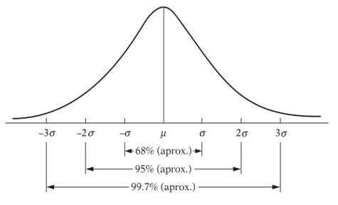

```{r setup, include=FALSE}
knitr::opts_chunk$set(echo = FALSE)
def.chunk.hook  <- knitr::knit_hooks$get("chunk")
knitr::knit_hooks$set(chunk = function(x, options) {
  x <- def.chunk.hook(x, options)
  paste0("\n \\", "tiny","\n\n", x, "\n\n \\normalsize")
})


```

```{r , echo=F, warning=F, message=F}
library(tibble)
library (kableExtra)
library(plyr)
library(tidyverse)
library(reshape2)
```

# Introducción al EDA multivariante

## EDA multivariante 

El **EDA multivariante** está fundamentado en la exploración, de manera simultánea, de dos o más características (variables) medidas en un conjunto de casos (Kachigan, 1991). El análisis univariante se centra en la variación, mientras que el análisis multivariante se centra en la **covariación** y **correlaciones** que refleja un conjunto de variables.

El análisis multivariante no sólo incluye estrategias de análisis exploratorio; sino, además, las siguientes técnicas:

- Componentes principales
- Análisis factorial
- Regresión múltiple
- Análisis discriminante múltiple
- Análisis multivariante de varianza
- Análisis cluster
- Análisis de correspondencias
- etc.


# Visualización de datos

## Variables categóricas

La asociación entre las variables categóricas **educación** y **área** es representada mediante la siguiente gráfica:

```{r, echo = F, eval = T}
ggplot(dataset,
       aes(x = factor(edu),
           fill = factor(edu))) + 

  geom_bar(
    aes(y = after_stat(count / ave(count, PANEL, FUN = sum)*100)),
    position = "dodge"
  ) + 

  labs(x = "Nivel de educación máxima", y = "Proporción (%)") + 
  
  ggtitle("Nivel de educación según área metropolitana") + 

  theme_bw() + 
  
  theme(plot.title = element_text(hjust = 0.5),
        axis.text.x = element_blank(),
        axis.ticks = element_blank()) +
  facet_wrap(~area, ncol = 5) +  labs(fill = "Nivel")

```


## Variables categóricas

Un análisis análogo puede ser implementado sobre las preguntas Sí/No. Véase la siguiente figura:


## Nota: prueba de independencia

## Variables continuas diferencias según niveles


## Variables continuas


# Análisis Exploratorio de Datos (EDA) Univariado

## Base de datos

La base de datos usada es extraída de los microdatos de la \textbf{Gran Encuesta Integrada de Hogares (GEIH)} para diciembre de 2023. El análisis considera las siguientes 13 ciudades y áreas metropolitanas:

::: columns
::: {.column width="30%"}

- Medellín A.M.
- Barranquilla A.M.
- Bogotá
- Cartagena
- Manizales A.M.


:::
  
::: {.column width="30%"}

- Monteria
- Villavicencio
- Pasto
- Cucuta A.M.
- Pereira A.M.

:::

::: {.column width="30%"}

- Pereira A.M.
- Bucaramanga A.M.
- Ibague 
- Cali A.M
:::
:::

\bigskip

La información es extraída de dos módulos de la GEIH:

- **Ocupados** (horas trabajadas , ingreso laboral, actividad económica, etc.)
- **Características generales, seguridad social en salud y educación** (edad, sexo, nivel de educación, etc.)


## Base de datos (cont.)

Para importar la base de datos (.xlsx),
```{r, echo=T, eval=F}
library(readxl)
dataset <- readxl::read_excel("Datos/Formatos/geih_dataset.xlsx")
```
La siguiente tabla muestra un resumen de la base de datos:
\begin{table}[ht]
\centering
\resizebox{5.5cm}{!}{
  \begin{tabular}{|l|l|l|}
  \hline
  \textbf{Variable} & \textbf{Clase}  & \textbf{Descripción}   \\
  \hline
  area & Factor & Área metropolitana \\ \hline
        dpto & Factor & Departamento \\ \hline
        sexo & Factor & Sexo al nacer \\ \hline
        parent & Factor & Parentesco con el jefe o jefa del hogar \\ \hline
        edad & Numérica & Años cumplidos \\ \hline
        edu & Factor & Mayor nivel educativo alcanzado \\ \hline
        ingreso & Numérica & Ingreso laboral \\ \hline
        horas\_semana & Numérica & Horas trabajadas normalmente a la semana \\ \hline
        cotiza & Factor & ¿Cotiza a un fondo de pensiones? \\ \hline
        lugar & Factor & Lugar principal de trabajo \\ \hline
        meses & Numérica & ¿Cuántos meses trabajó en los últimos 12 meses? \\ \hline
        rama\_4 & Cadena & Rama de actividad CIIU REV 4 (4 dígitos) \\ \hline
        rama\_2 & Cadena & Rama de actividad CIIU REV 4 (4 dígitos) \\ \hline
        posic & Factor & Posición laboral \\ \hline
        fondo & Factor & ¿A cuál fondo cotiza? \\ \hline
        cambiar & Factor & ¿Desea cambiar su trabajo? \\ \hline
        estable & Factor & ¿Considera que su empleo es estable? \\ \hline
        t\_actual & Continua & ¿Cuánto tiempo lleva en su empleo actual? \\ \hline
        t\_viaje & Continua & Tiempo de desplazamiento al trabajo \\ \hline
        mas\_h & Continua & ¿Quiere trabajar más horas? \\ \hline
        medio & Factor & Medio de transporte \\ \hline
        sintrab & Factor & ¿Si no tuviera trabajo, de dónde obtendría sus recursos? \\ \hline
        n\_comp & Factor & ¿Cuántas personas tiene la empresa donde trabajo? \\ \hline
        srl & Factor & ¿Afiliación a ARL? \\ \hline
        caja & Factor & ¿Afiliación a caja de compensación familiar? \\ \hline
        actividad & Factor & Actividad económica recodificada \\ \hline
        cotiza\_fondo & Factor & Fondo de pensiones recodificado \\ \hline
        factor\_exp & Numérica & Factor de expansión \\ \hline
  \end{tabular}
}
\label{tab:multicol}
\end{table}

## Resumen de datos cualitativos:
Considérese las siguientes variables cualitativas previamente recodificadas:


::: columns
::: {.column width="30%"}

\bigskip

- La función `forcats::fct_lump_n()`es usada para agregar las categoría en "otros".

- Las gráficas muestran las 10 categorías más frecuentes.

- La función `ggplot2::facet_wrap` es usada para obtener los gráficos múltiples

:::
  
::: {.column width="70%"}

```{r, echo=F, eval = T}
plot_cat <- readRDS("C:/Users/Portatil/Desktop/Curso_EDA_2024_I/Módulos/Módulo 2/Figuras/plot_cat.rds")
```


```{r, echo=F, eval = T, fig.height=10, out.height="0.8\\textheight", fig.align="center"}
plot_cat
```
:::
:::

## Resumen de datos cualitativos (cont.):

Idéntica información puede ser representada mediante el siguiente resumen:

```{r, echo=F, eval = T}
count_prop <- tibble(readRDS("C:/Users/Portatil/Desktop/Curso_EDA_2024_I/Módulos/Módulo 2/Figuras/count_prop.rds"))

count_prop <- count_prop %>% dplyr::filter(!is.na(value))
count_prop <- count_prop %>% dplyr::filter(name %in% c("actividad",
                                                       "edu",
                                                       "cotiza_fondo"))
  
count_prop$name <-  revalue(factor(count_prop$name), 
                                  c("actividad"="Actividad económica", "edu" = "Educación",
                                    "cotiza_fondo" = "Fondo de pensiones"))  
#count_prop$value = substr(count_prop$value, 1, 35)
count_prop$Share = round(count_prop$Share, 2)
```

\centering
\resizebox{11cm}{!}{ 

```{r, echo=F, eval = T}
kable(count_prop[,2:ncol(count_prop)], format = "latex", booktabs = T,
      col.names = c(" ", "N", "Proporción (%)")) %>% 
  pack_rows(index = table(count_prop$name))
```

}

## Resumen de datos cualitativos (cont.):

El siguiente panel muestra un resumen para las variables dicotómicas:

```{r, echo=F, eval = T}
plot_dic <- readRDS("C:/Users/Portatil/Desktop/Curso_EDA_2024_I/Módulos/Módulo 2/Figuras/plot_dic.rds")
```
```{r, echo=F, eval = T, fig.height=5, fig.align="center"}
plot_dic
```


## Resumen de datos cuantitativos


::: columns
::: {.column width="30%"}

#### Histograma

El **Histograma** (**Figura X**) es una representación gráfica de los datos que muestra la frecuencia de los casos (valores) en categorías de datos (**Tabla 1**).


:::
  
::: {.column width="70%"}

```{r, echo=FALSE, eval = T, warning=F}
dataset <- readxl::read_excel("geih_dataset.xlsx")
ggplot(data = dataset) +
  geom_histogram(mapping = aes(x = ingreso/1000, col = ingreso),
                 fill = "lightskyblue", col = "black",
                 binwidth = 400) + xlim(c(0, 15000))  + theme_bw()
```


:::
:::

```{r, echo=FALSE, eval = T}
count = dataset %>% count(cut_width(ingreso/1000, 1000, boundary = 0, dig.lab = 6),
                          name = "n") %>% t()
colnames(count) = count[1,]
count2 = as.data.frame(count[2,1:8]) %>% t()


kable(count2, col.names = NA, row.names = F, format = "latex", booktabs = T)
```

## Resumen de datos cuantitativos (cont.)

Se presenta un análisis sobre la distribución de las demás variables cuantitativas


```{r, echo = F, eval = T}
hist_ds <- dataset[c("id", "edad",
                     "horas_semana", "t_actual",
                     "t_viaje")]

hist_melt <- melt(hist_ds)

figure_3 <- ggplot(data = hist_melt, aes(x = value,
                                         fill = variable)) + geom_histogram(bins = 15,
                                                                            col = "black") + 
  facet_wrap(~variable, scales = "free",
             labeller = labeller(variable = c(`edad` = "Edad",
                                              `horas_semana` = "Horas trabajadas (semana)",
                                              `t_actual` = "Tiempo (empleo actual)",
                                              `t_viaje` = "Tiempo de viaje"))) + guides(fill = "none") + theme_bw() +
  labs(x = " ")
figure_3
```


## Resumen de datos cuantitativos (cont.)

La **función de densidad empírica** $f(x)$ y la **función de distribución acumulada empírica** $F(x)$ son obtenidas mediante las funciones `density()` y  `ecdf()` del paquete `Stats`.


::: columns
::: {.column width="50%"}

```{r, echo=FALSE, eval = T}
ggplot(data = dataset, aes(x = edad)) + 
  geom_density(color = "black",
               alpha = 0.2, fill = "gray45") +
  theme_bw() + labs(x = "Edad", y = "Density",
                    title = "Edad (años cumplidos)")
```

:::
  
::: {.column width="50%"}

```{r, echo=FALSE, eval = T}
ggplot(data = dataset,
       aes(x = edad)) + stat_ecdf(geom = "step",
                                  color = "gray45") +
  theme_bw() + labs(x = "Edad", y = "ECDF",
                    title = "Edad (años cumplidos)")
```

:::
:::

## Resumen de datos cuantitativos (cont.)

Un ejercicio análogo es implementado para las demás variables cuantitativas. 


```{r, echo=FALSE, eval = T, warning=F}
hist_ds <- dataset[c("id", "edad", "ingreso",
                     "horas_semana", "t_actual",
                     "t_viaje")]
hist_ds$ingreso <- hist_ds$ingreso/1000

hist_melt <- melt(hist_ds)

figure_4 <- ggplot(data = hist_melt, aes(x = value,
                                         fill = variable)) + stat_ecdf(geom = "step",
                                                                       color = "gray45") + 
  facet_wrap(~variable, scales = "free",
             labeller = labeller(variable = c(`edad` = "Edad",
                                              `horas_semana` = "Horas trabajadas (semana)",
                                              `t_actual` = "Tiempo (empleo actual)",
                                              `t_viaje` = "Tiempo de viaje",
                                              `ingreso`= "Ingreso laboral"))) + guides(fill = "none") + theme_bw() +
  labs(x = " ")
figure_4
```


## Resumen de datos cuantitativos (cont.)

#### Diagrama de caja
El diagrama de caja es una representación gráfica de la distribución de los datos

{width=250}

## Resumen de datos cuantitativos (cont.)

La librería `StatDA()` proporciona una utilidad para representar la distribución y los principales elementos descriptivos de las variables continuas. 

::: columns
::: {.column width="55%"}

```{r, echo=T, eval = F}
library(StatDA)
library(moments)

me = mean(dataset$edad)
sd = sd(dataset$edad)

StatDA::edaplot(dataset$edad, scatter=TRUE, H.freq=FALSE, box=TRUE, 
                H.breaks=seq(0,100, by = 4),
                H.col="lightgray", H.border=TRUE, H.labels=FALSE,
                S.pch=1, S.col="blue", S.cex=0.5,
                D.lwd=2, D.lty=1, D.plot=FALSE,
                P.xlim=c(1, 91), P.cex.lab =1.2,
                P.log=FALSE, P.main="Histogram,
                Density Plot, Scatterplot,
	and Boxplot of Rate",
                P.xlab="Edad (años)", P.plot=TRUE,
                P.ylab="Density",
                B.pch=1,B.cex=0.5, B.col="red")
lines(density(dataset$edad), lwd=2, col='blue')
curve(dnorm(x, mean=me, sd=sd), from=0, to=100, add=T,
      col='red', lwd=3)
leg.txt <- c(paste0("Min. = ", round(min(dataset$edad),4)),
             paste0("Max. = ", round(max(dataset$edad),4)),
             paste0("Mean = ", round(mean(dataset$edad),4)),
             paste0("Median = ", round(median(dataset$edad),4)),
             paste0("Std. dev. = ", round(sd(dataset$edad),4)),
             paste0("Kurtosis = ", round(kurtosis(dataset$edad),4)),
             paste0("Skewness = ", round(skewness(dataset$edad),4)))
legend (x=-3, y=0.028, bty="n", leg.txt)
```

:::
  
::: {.column width="45%"}

```{r, echo=FALSE, eval = T, warning=F, message=F}
library(StatDA)
library(moments)

me = mean(dataset$edad)
sd = sd(dataset$edad)

StatDA::edaplot(dataset$edad, scatter=TRUE, H.freq=FALSE, box=TRUE, 
                H.breaks=seq(0,100, by = 4),
                H.col="lightgray", H.border=TRUE, H.labels=FALSE,
                S.pch=1, S.col="blue", S.cex=0.5,
                D.lwd=2, D.lty=1, D.plot=FALSE,
                P.xlim=c(1, 91), P.cex.lab =1.2,
                P.log=FALSE, P.main="Histogram, Density Plot, Scatterplot,
	and Boxplot of Rate",
                P.xlab="Edad (años)", P.plot=TRUE,
                P.ylab="Density",
                B.pch=1,B.cex=0.5, B.col="red")
lines(density(dataset$edad), lwd=2, col='blue')
curve(dnorm(x, mean=me, sd=sd), from=0, to=100, add=T,
      col='red', lwd=3)
leg.txt <- c(paste0("Min. = ", round(min(dataset$edad),4)),
             paste0("Max. = ", round(max(dataset$edad),4)),
             paste0("Mean = ", round(mean(dataset$edad),4)),
             paste0("Median = ", round(median(dataset$edad),4)),
             paste0("Std. dev. = ", round(sd(dataset$edad),4)),
             paste0("Kurtosis = ", round(kurtosis(dataset$edad),4)),
             paste0("Skewness = ", round(skewness(dataset$edad),4)))
legend (x=-3, y=0.028, bty="n", leg.txt)
```

:::
:::


## Valores atípicos

La perspectiva univariante selecciona como **valores atípicos** u **outliers** aquellas observaciones que caen fuera de los rangos de la distribución. Un valor atípico se puede producir por alguna de las siguientes cuatro causas (Aldás y Uriel, 2017):

- **Errores en los datos**: errores en la recolección o introducción de los datos.

- **Erorres voluntarios**: errores intencionados en la respuesta del entrevistado.

- **Errores de muestreo**: errores que son el resultado de introducir en la muestra a individuos pertenecientes a una población distinta a la **población objetivo**.

- **Outliers legítimos**: caso de la población objetivo que, por la variabilidad de las muestras, difiere del resto de casos.


## Detección univariada de valores atípicos

Considérese las siguientes alternativas para la detección univariante de *outliers*:

#### Criterio intercuartílico

$$
x^{*} \in [q_{0.25} - 1.5IQR, q_{0.75} + 1.5IQR]
$$

#### Criterio de valores estandarizados (Hair et al., 2014)

- Para muestras pequeñas ($n < 80$), $x^{*}$ tiene valores estándar de 2.5 o superiores.

- Para muestras mayores ($n \geq 80$), $x^{*}$ tiene valores estándar de 3-4 o superiores.

#### Test de Grubbs

El **Test de Grubbs** supone la normalidad de la distribución (Grubbs, 1969; Stefansky, 1971). La hipótesis nula (no hay *outliers*) se rechaza si

$$
G > \frac{n-1}{n}\sqrt{\frac{t^{2}_{(\alpha/2n, n-2)}}{n-2+t^{2}_{(\alpha/2n, n-2)}}}
$$

donde $G = {max |x_{i} - \bar{x}|}/{\sigma}$

## Criterio intercuartílico y criterio de Hair et al. (1999)


::: columns
::: {.column width="50%"}

```{r, eval = T, echo=FALSE,message=F, warning=F, prompt=FALSE, results = FALSE}
# Se propone el mismo ejercicio con otra variable: edad
# Resumen descriptivo total
library(janitor)
dataset$ingreso2 = dataset$ingreso/1000

# Definición de función Q2(Q1 - Q3)
quantile_f <- function(x){
  q1 <- quantile(x, na.rm = T, 0.25)
  q2 <- quantile(x, na.rm = T, 0.5)
  q3 <- quantile(x, na.rm = T, 0.75)
  y <- paste0(round(as.numeric(q2), 1), " (",
              round(as.numeric(q1), 2), " - ",
              round(as.numeric(q3), 2), ")")
  return(y)
}

cali <- dataset %>% filter(area == "Cali")

# Lo mismo puede ser obtenido manualmente
Q1 <- quantile(cali$horas_semana, .25, na.rm = T)
Q3 <- quantile(cali$horas_semana, .75, na.rm = T)
IQR <- IQR(cali$horas_semana, na.rm = T)

outliers <- cali %>% filter(horas_semana<(Q1 - 1.5*IQR) | horas_semana>(Q3 + 1.5*IQR))

# Identificación de los outliers en la gráfica
plot(cali$horas_semana, type='p',
     col=ifelse(cali$horas_semana %in% outliers$horas_semana, "red", "black"),
     pch = ifelse(cali$horas_semana %in% outliers$horas_semana, 17, 1),
     ylim = c(0, 100),
     main = "Detección univariante de outliers: criterio IQR")
```


:::
  
::: {.column width="50%"}

```{r, eval = T, echo=FALSE,message=F, warning=F, prompt=FALSE, results = FALSE}
z <- data.frame(id = seq(1, nrow(cali), by = 1),
                x = cali$horas_semana,
                z = scale(cali$horas_semana))

outliers1 <- z  %>% filter(abs(z) > 2.5)
outliers2 <- z  %>% filter(abs(z) > 4)

par(mfrow = c(1,2))
plot(cali$horas_semana, type='p',
     col=ifelse(cali$horas_semana %in% outliers1$x, "red", "black"),
     pch = ifelse(cali$horas_semana %in% outliers1$x, 17, 16),
     
     main = "Criterio de Hair et al. (2019): z > 2.5")
plot(cali$horas_semana, type='p',
     col=ifelse(cali$horas_semana %in% outliers2$x, "red", "black"),
     pch = ifelse(cali$horas_semana %in% outliers2$x, 17, 16),
     
     main = "Criterio de Hair et al. (2019): z > 4")
```


:::
:::


## Resumen descriptivo: outliers y no-outliers

```{r, echo=F, eval =T}
# Resumen descriptivo total
dataset_continuas = dataset[c("ingreso2",
                                  "edad", "horas_semana",
                                  "t_actual", "t_viaje")]

melt_continuas <- melt(dataset_continuas)

mean_f <- function(x){
  return(mean(x, na.rm =T))
}
sd_f <- function(x){
  return(sd(x, na.rm =T))
}
q1_f  <- function(x){
  return(quantile(x, na.rm =T, 0.25))
}
q2_f  <- function(x){
  return(quantile(x, na.rm =T, 0.5))
}
q3_f  <- function(x){
  return(quantile(x, na.rm =T, 0.75))
}

out_summary <- melt_continuas %>% dplyr::group_by(variable) %>% 
 summarise(across(everything(), list( 
   mean = mean_f,
   sd = sd_f,
   q1 = q1_f,
   q2 = q2_f,
   q3 = q3_f)))

out_summary$group = "outliers"

no.outliers_summary <- out_summary

for (k in 1:5) {
  df_1 = df_2 = dataset_continuas[,k]
  df_2$z = as.vector(scale(df_1[,1]))
  
  df_2 = df_2 %>% filter(abs(z) <= 3)
  
  df_1$group = "outliers"
  df_2$group = "no-outliers"
  
  df_2 = df_2[,c(1,3)]
  colnames(df_2) = c("x", "group")
  
  no.outliers_summary$value_mean[k] = mean_f(df_2$x)
  no.outliers_summary$value_sd[k] = sd_f(df_2$x)
  no.outliers_summary$value_q1[k] = q1_f(df_2$x)
  no.outliers_summary$value_q2[k] = q2_f(df_2$x)
  no.outliers_summary$value_q3[k] = q3_f(df_2$x)
}

no.outliers_summary$group = "no-outliers"

whole_out <- rbind(out_summary, no.outliers_summary)

kable(whole_out[,1:6], format = "latex", booktabs = T,
      col.names = c(" ", "Mean",
                    "SD", "Q1", "Q2", "Q3")) %>% 
  pack_rows(index = table(whole_out$group))

```


## Alternativas

Algunas alternativas para el tratamiento de valores atípicos son las siguientes:

1. Eliminación de los valores atípicos para garantizar estimaciones correctas sobre la mayoría de la población (Judd et al., 2009).

2. Suavizar la influencia de los valores atípicos mediante el uso de transformaciones (raíces o logaritmos) para reducir su rango (Hamilton, 1992)

3. Análisis estadístico **robusto**.

#### Desventajas

- Perdida de información

- No todas las transformaciones conservan el sentido teórico de la escala original.


# Pruebas diagnóstico

## Distribución normal univariada

::: columns
::: {.column width="50%"}

Una variable aleatoria continua $X$ está normalmente distribuida si su **función de densidad** sigue la forma:

$$
f(x) = \frac{1}{\sigma  \sqrt{2\pi}}exp\left\{\frac{-1}{2\sigma^{2}}(x - \mu)^{2}\right\}
$$
donde

$$
f(x) \geq 0
$$
$$
\int_{-\infty}^{\infty} f(x)dx = 1
$$

$$
\int_{a}^{b} f(x)dx = P(a \leq x \leq b)
$$

**Parámetros de la distribución:** media($\mu$) y varianza ($\sigma^{2}$) de la distribución.

:::
  
::: {.column width="50%"}

\bigskip

\bigskip



:::
:::


## Normalidad univariada 

El gráfico **cuantil-cuantil** (gráfico Q-Q) compara dos distribuciones de probabilidad usando sus cuantiles. Usando la librería `car`, comparamos la distribución de probabilidad de una muestra aleatoria con la distribución normal. 

```{r, echo=F, eval = T, message=F, warning=F, prompt=FALSE, results = FALSE}
library(car)
par(mfrow = c(2,3))
qqPlot(dataset$ingreso/1000, main = "Ingreso laboral (miles $)", ylab  = " ")
qqPlot(dataset$edad, main = "Edad (años)", ylab = " ")
qqPlot(dataset$horas_semana, main = "Horas trabajadas (semana)", ylab = " ")
qqPlot(dataset$t_actual, main = "Tiempo en el trabajo actual", ylab = " ")
qqPlot(dataset$t_viaje, main = "Tiempo de desplazamiento", ylab = " ")
```


## Normalidad univariada (cont.)


La intuición del método gráfico es verificada mediante pruebas formales. Usando la librería `nortest`:


```{r, eval = T, echo=F}
# Analizar la normalidad de las variables continuas
library(nortest) # Anderson-Darling, Kolmogorov-Smirnov (Lilliefors)


############################## Paréntesis: esto es únicamente para la presentación ######################################
nortest_function <- function(x, y){
  if (is.function(y)) {
    w <- x[!is.na(x)]
    return(y(w)$p.value)
  } else {return("Y no es una función")}
}


ad <- dataset %>% dplyr::select(ingreso,
                                    edad, horas_semana,
                                    t_actual, t_viaje) %>% 
  summarise(across(c("ingreso",
                     "edad", "horas_semana",
                     "t_actual", "t_viaje"),
                   ~ nortest_function(.x, ad.test))) %>% t() 

li <- dataset %>% dplyr::select(ingreso,
                                    edad, horas_semana,
                                    t_actual, t_viaje) %>% 
  summarise(across(c("ingreso",
                     "edad", "horas_semana",
                     "t_actual", "t_viaje"),
                   ~ nortest_function(.x, lillie.test))) %>% t()  

pearson <- dataset %>% dplyr::select(ingreso,
                                         edad, horas_semana,
                                         t_actual, t_viaje) %>% 
  summarise(across(c("ingreso",
                     "edad", "horas_semana",
                     "t_actual", "t_viaje"),
                   ~ nortest_function(.x, pearson.test))) %>% t() 


df_summary <- data.frame(variable = rownames(ad),
                         ad_test = round(ad, 6),
                         li_test = round(li,6),
                         pearson_test = round(pearson, 6))

```


```{r, eval = T, echo=F}
kable(df_summary, col.names = c("variable",
                                "Anderson-Darling",
                                "Lilliefors (Kolmogorov-Smirnov)",
                                "Pearson chi-square"), row.names = F,
      format = "latex", booktabs = T)
```

Se examinan  las siguientes transformaciones


::: columns
::: {.column width="30%"}


```{r, echo = F}
nortest_function <- function(x, y){
  if (is.function(y)) {
    w <- x[!is.na(x)]
    w <- w[w > 0]
    return(y(log(w))$p.value)
  } else {return("Y no es una función")}
}


ad <- dataset %>% dplyr::select(ingreso,
                                    edad, horas_semana,
                                    t_actual, t_viaje) %>% 
  summarise(across(c("ingreso",
                     "edad", "horas_semana",
                     "t_actual", "t_viaje"),
                   ~ nortest_function(.x, ad.test))) %>% t() 

li <- dataset %>% dplyr::select(ingreso,
                                    edad, horas_semana,
                                    t_actual, t_viaje) %>% 
  summarise(across(c("ingreso",
                     "edad", "horas_semana",
                     "t_actual", "t_viaje"),
                   ~ nortest_function(.x, lillie.test))) %>% t()  

pearson <- dataset %>% dplyr::select(ingreso,
                                         edad, horas_semana,
                                         t_actual, t_viaje) %>% 
  summarise(across(c("ingreso",
                     "edad", "horas_semana",
                     "t_actual", "t_viaje"),
                   ~ nortest_function(.x, pearson.test))) %>% t() 


df_summary <- data.frame(variable = rownames(ad),
                         ad_test = round(ad, 6),
                         li_test = round(li,6),
                         pearson_test = round(pearson, 6))
```

```{r, eval = T, echo=F}
kable(df_summary, col.names = c("log(x)",
                                "A-D",
                                "K-S)",
                                "P"), row.names = F,
      format = "latex", booktabs = T)
```

:::
  
::: {.column width="30%"}

```{r, echo = F}
nortest_function <- function(x, y){
  if (is.function(y)) {
    w <- x[!is.na(x)]
    w <- w[w > 0]
    return(y(sqrt(w))$p.value)
  } else {return("Y no es una función")}
}


ad <- dataset %>% dplyr::select(ingreso,
                                    edad, horas_semana,
                                    t_actual, t_viaje) %>% 
  summarise(across(c("ingreso",
                     "edad", "horas_semana",
                     "t_actual", "t_viaje"),
                   ~ nortest_function(.x, ad.test))) %>% t() 

li <- dataset %>% dplyr::select(ingreso,
                                    edad, horas_semana,
                                    t_actual, t_viaje) %>% 
  summarise(across(c("ingreso",
                     "edad", "horas_semana",
                     "t_actual", "t_viaje"),
                   ~ nortest_function(.x, lillie.test))) %>% t()  

pearson <- dataset %>% dplyr::select(ingreso,
                                         edad, horas_semana,
                                         t_actual, t_viaje) %>% 
  summarise(across(c("ingreso",
                     "edad", "horas_semana",
                     "t_actual", "t_viaje"),
                   ~ nortest_function(.x, pearson.test))) %>% t() 


df_summary <- data.frame(variable = rownames(ad),
                         ad_test = round(ad, 6),
                         li_test = round(li,6),
                         pearson_test = round(pearson, 6))
```

```{r, eval = T, echo=F}
kable(df_summary, col.names = c("sqrt(x)",
                                "A-D",
                                "K-S)",
                                "P"), row.names = F,
      format = "latex", booktabs = T)
```


:::

::: {.column width="30%"}

```{r, echo = F}
nortest_function <- function(x, y){
  if (is.function(y)) {
    w <- x[!is.na(x)]
    w <- w[w > 0]
    return(y((w^(1/3)))$p.value)
  } else {return("Y no es una función")}
}


ad <- dataset %>% dplyr::select(ingreso,
                                    edad, horas_semana,
                                    t_actual, t_viaje) %>% 
  summarise(across(c("ingreso",
                     "edad", "horas_semana",
                     "t_actual", "t_viaje"),
                   ~ nortest_function(.x, ad.test))) %>% t() 

li <- dataset %>% dplyr::select(ingreso,
                                    edad, horas_semana,
                                    t_actual, t_viaje) %>% 
  summarise(across(c("ingreso",
                     "edad", "horas_semana",
                     "t_actual", "t_viaje"),
                   ~ nortest_function(.x, lillie.test))) %>% t()  

pearson <- dataset %>% dplyr::select(ingreso,
                                         edad, horas_semana,
                                         t_actual, t_viaje) %>% 
  summarise(across(c("ingreso",
                     "edad", "horas_semana",
                     "t_actual", "t_viaje"),
                   ~ nortest_function(.x, pearson.test))) %>% t() 


df_summary <- data.frame(variable = rownames(ad),
                         ad_test = round(ad, 6),
                         li_test = round(li,6),
                         pearson_test = round(pearson, 6))
```

```{r, eval = T, echo=F}
kable(df_summary, col.names = c("cuberoot(x)",
                                "A-D",
                                "K-S)",
                                "P"), row.names = F,
      format = "latex", booktabs = T)
```


:::
:::

## Normalidad univariada (cont.)

El siguiente panel corresponde a los gráficos Q-Q para las variables transformadas:

```{r, echo=F, eval = T, message=F, warning=F, prompt=FALSE, results = FALSE}
library(car)
df <- dataset %>% filter(ingreso >0, edad >0,
                         horas_semana>0, t_actual >0, t_viaje >0)

par(mfrow = c(3,5))

qqPlot(log(df$ingreso/1000), main = "Log Ingreso laboral (miles $)", ylab  = " ")
qqPlot(log(df$edad), main = "Log Edad (años)", ylab = " ")
qqPlot(log(df$horas_semana), main = "Log Horas trabajadas (semana)", ylab = " ")
qqPlot(log(df$t_actual), main = "Log Tiempo en el trabajo actual", ylab = " ")
qqPlot(log(df$t_viaje), main = "Log Tiempo de desplazamiento", ylab = " ")

qqPlot(sqrt(df$ingreso/1000), main = "Sqrt Ingreso laboral (miles $)", ylab  = " ")
qqPlot(sqrt(df$edad), main = "Sqrt Edad (años)", ylab = " ")
qqPlot(sqrt(df$horas_semana), main = "Sqrt Horas trabajadas (semana)", ylab = " ")
qqPlot(sqrt(df$t_actual), main = "Sqrt Tiempo en el trabajo actual", ylab = " ")
qqPlot(sqrt(df$t_viaje), main = "Sqrt Tiempo de desplazamiento", ylab = " ")

qqPlot((df$ingreso/1000)^(1/3), main = "Crt Ingreso laboral (miles $)", ylab  = " ")
qqPlot((df$edad)^(1/3), main = "Crt Edad (años)", ylab = " ")
qqPlot((df$horas_semana)^(1/3), main = "Crt Horas trabajadas (semana)", ylab = " ")
qqPlot((df$t_actual)^(1/3), main = "Crt Tiempo en el trabajo actual", ylab = " ")
qqPlot((df$t_viaje)^(1/3), main = "Crt Tiempo de desplazamiento", ylab = " ")

```

## Resumen descriptivo (mediana e IQR)

```{r, eval = T, echo=FALSE,message=F, warning=F}


total <- dataset %>% dplyr::select(ingreso2,
                                    edad, horas_semana,
                                    t_actual, t_viaje) %>% 
  summarise(across(everything(),
                   ~ quantile_f(.x)))

q_total <- data.frame(area = "Total",
                      ingreso2_sum = total$ingreso2,
                      edad_sum = total$edad,
                      horas_semana_sum = total$horas_semana,
                      t_actual_sum = total$t_actual,
                      t_viaje_sum = total$t_viaje)

# Resumen descriptivo por grupos
q_group <- dataset %>%
  group_by(area) %>%
  summarise(across(c("ingreso2",
                     "edad", "horas_semana",
                     "t_actual", "t_viaje"),
                   list(sum = quantile_f))) %>% as.data.frame() 


cont_summary <- rbind(q_total, q_group)

kable(cont_summary, format = "latex",
                  booktabs = T, col.names = c("Área" ,"Ingreso",
                                              "Edad", "Horas (semana)", "Tiempo actual", "Tiempo de viaje"))
```
