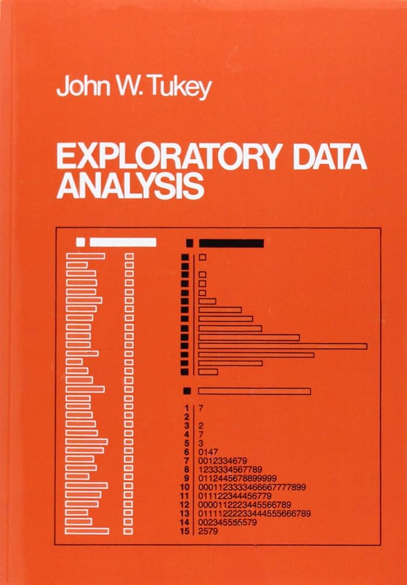
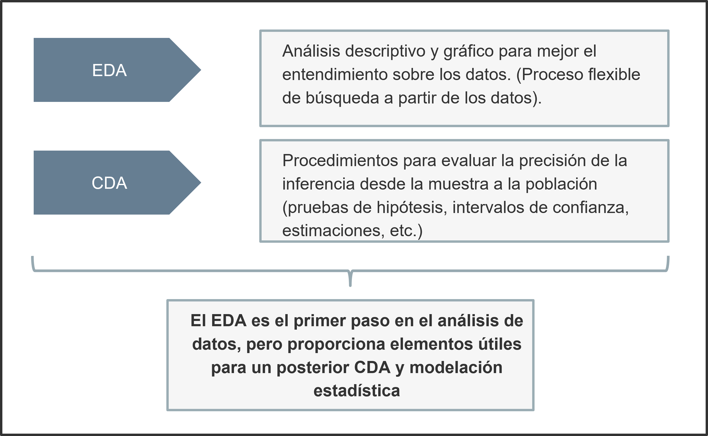

```{r setup, include=FALSE}
knitr::opts_chunk$set(echo = FALSE,warning = FALSE, message = FALSE)
def.chunk.hook  <- knitr::knit_hooks$get("chunk")
knitr::knit_hooks$set(chunk = function(x, options) {
  x <- def.chunk.hook(x, options)
  paste0("\n \\", "tiny","\n\n", x, "\n\n \\normalsize")
})


```

```{r , echo=F, warning=F, message=F}
library(tibble)
library (kableExtra)
library(plyr)
library(tidyverse)
library(reshape2)
library(corrplot)
library(psych)
```

# Recordatorio: sintaxis de ggplot2

El paquete **ggplot2** proporciona un sistema coherente para visualizar datos y crear gráficos. La versatilidad de **ggplot2** radica en el uso de la Gramática de Gráficos (*Grammar of Graphics*).

```{r, eval =F, echo=T}
ggplot(dataset, aes()) + geometría + faceta + opciones
```

donde:
  
\begin{enumerate}

\item{\textit{dataset} es un data frame}

\item{Las características del mapa \textbf{aes()} describe los ejes $(x,y)$, el color exterior (\textbf{color} o \textbf{colour}), el color interior (\textbf{fill}), la forma de los puntos (\textbf{shape}), el tipo de línea (\textbf{linetype}) y el tamaño (\textbf{size})}

\item{Los objetos geométricos (\textbf{geometría}) determinan el tipo de gráfico:
    
  \begin{itemize}
  
  \item{Puntos ($geom\_point$)}
  \item{Líneas ($geom\_lines$)}
  \item{Histogramas ($geom\_histogram$)}
  \item{Boxplot ($geom\_boxplot$)}
  
  \end{itemize}
}

\item{La \textbf{faceta} permite dividir un gráfico en múltiples gráficos de acuerdo con grupos}


\end{enumerate}


# Introducción al EDA

## ¿Qué es el EDA?

::: columns
::: {.column width="60%"}

\bigskip

\bigskip

\bigskip

El Análisis Exploratorio de Datos (EDA, por sus siglas en inglés) proporciona una estrategia robusta para ampliar el entendimiento sobre los datos. El principio general es el siguiente:

\bigskip

#### 

“Es importante comprender lo que podemos hacer antes de aprender a medir lo bien que parece que lo hemos hecho” \textcolor{cyan}{(Tukey, 1977)}.

:::
  
::: {.column width="40%"}

:::
:::


## Utilidad

Mediante métodos gráficos y descriptivos, el EDA permite \textcolor{cyan}{(Carranza, 2021)}:

- Revelar la estructura de los datos

- Determinar las variables relevantes
- Determinar valores atípicos
- Proponer hipótesis
- Proponer estrategias para la modelación

## EDA y CDA
{width=350}


# Análisis exploratorio univariante

## Base de datos

La base de datos usada es extraída de los microdatos de la \textbf{Gran Encuesta Integrada de Hogares (GEIH)} para diciembre de 2023. El análisis considera las siguientes 13 ciudades y áreas metropolitanas:

::: columns
::: {.column width="30%"}

- Medellín A.M.
- Barranquilla A.M.
- Bogotá
- Cartagena
- Manizales A.M.


:::
  
::: {.column width="30%"}

- Monteria
- Villavicencio
- Pasto
- Cucuta A.M.
- Pereira A.M.

:::

::: {.column width="30%"}

- Pereira A.M.
- Bucaramanga A.M.
- Ibague 
- Cali A.M
:::
:::

\bigskip

La información es extraída de dos módulos de la GEIH:

- **Ocupados** (horas trabajadas , ingreso laboral, actividad económica, etc.)
- **Características generales, seguridad social en salud y educación** (edad, sexo, nivel de educación, etc.)


## Base de datos (cont.)

Para importar la base de datos (.xlsx),
```{r, echo=T, eval=F}
library(readxl)
dataset <- readxl::read_excel("Datos/Formatos/geih_dataset.xlsx")
cont_ds <- dataset %>% dplyr::select(ingreso, edad, horas_semana, t_actual)
cont_ds <- cont_ds %>% dplyr::filter(t_actual > 0)
```
La siguiente tabla muestra un resumen de la base de datos:
\begin{table}[ht]
\centering
\resizebox{5.5cm}{!}{
  \begin{tabular}{lll}
  \hline
  \textbf{Variable} & \textbf{Clase}  & \textbf{Descripción}   \\
  \hline
  area & Factor & Área metropolitana \\ 
        dpto & Factor & Departamento \\ 
        sexo & Factor & Sexo al nacer \\ 
        parent & Factor & Parentesco con el jefe o jefa del hogar \\ 
        edad & Numérica & Años cumplidos \\
        edu & Factor & Mayor nivel educativo alcanzado \\ 
        ingreso & Numérica & Ingreso laboral \\ 
        horas\_semana & Numérica & Horas trabajadas normalmente a la semana \\ 
        cotiza & Factor & ¿Cotiza a un fondo de pensiones? \\ 
        lugar & Factor & Lugar principal de trabajo \\ 
        meses & Numérica & ¿Cuántos meses trabajó en los últimos 12 meses? \\ 
        rama\_4 & Cadena & Rama de actividad CIIU REV 4 (4 dígitos) \\ 
        rama\_2 & Cadena & Rama de actividad CIIU REV 4 (4 dígitos) \\ 
        posic & Factor & Posición laboral \\ 
        fondo & Factor & ¿A cuál fondo cotiza? \\ 
        cambiar & Factor & ¿Desea cambiar su trabajo? \\ 
        estable & Factor & ¿Considera que su empleo es estable? \\ 
        t\_actual & Numérica & ¿Cuánto tiempo lleva en su empleo actual? \\ 
        t\_viaje & Numérica & Tiempo de desplazamiento al trabajo \\ 
        mas\_h & Factor & ¿Quiere trabajar más horas? \\ 
        medio & Factor & Medio de transporte \\ 
        sintrab & Factor & ¿Si no tuviera trabajo, de dónde obtendría sus recursos? \\ 
        n\_comp & Factor & ¿Cuántas personas tiene la empresa donde trabajo? \\ 
        srl & Factor & ¿Afiliación a ARL? \\ 
        caja & Factor & ¿Afiliación a caja de compensación familiar? \\ 
        actividad & Factor & Actividad económica recodificada \\ 
        cotiza\_fondo & Factor & Fondo de pensiones recodificado \\ 
        factor\_exp & Numérica & Factor de expansión \\ \hline\hline
  \end{tabular}
}
\label{tab:multicol}
\end{table}

## Datos cualitativos:


### Resumen de datos cualitativos

Considérese las siguientes variables cualitativas previamente recodificadas:

::: columns
::: {.column width="30%"}

\bigskip

- La función `forcats::fct_lump_n()`es usada para agregar las categoría en "otros".

- Las gráficas muestran las 10 categorías más frecuentes.

- La función `ggplot2::facet_wrap` es usada para obtener los gráficos múltiples

:::
  
::: {.column width="70%"}

```{r, echo=F, eval = T}
plot_cat <- readRDS("C:/Users/PC/Desktop/Curso_EDA_2024_I/Módulos/Módulo 2/Figuras/plot_cat.rds")
```


```{r, echo=F, eval = T, fig.height=10, out.height="0.8\\textheight", fig.align="center"}
plot_cat
```
:::
:::

## Resumen de datos cualitativos (cont.):

Idéntica información puede ser representada mediante el siguiente resumen:

```{r, echo=F, eval = T}
count_prop <- tibble(readRDS("C:/Users/PC/Desktop/Curso_EDA_2024_I/Módulos/Módulo 2/Figuras/count_prop.rds"))

count_prop <- count_prop %>% dplyr::filter(!is.na(value))
count_prop <- count_prop %>% dplyr::filter(name %in% c("actividad",
                                                       "edu",
                                                       "cotiza_fondo"))
  
count_prop$name <-  revalue(factor(count_prop$name), 
                                  c("actividad"="Actividad económica", "edu" = "Educación",
                                    "cotiza_fondo" = "Fondo de pensiones"))  
#count_prop$value = substr(count_prop$value, 1, 35)
count_prop$Share = round(count_prop$Share, 2)
```

\centering
\resizebox{11cm}{!}{ 

```{r, echo=F, eval = T}
kable(count_prop[,2:ncol(count_prop)], format = "latex", booktabs = T,
      col.names = c(" ", "N", "Proporción (%)")) %>% 
  pack_rows(index = table(count_prop$name))
```

}

## Resumen de datos cualitativos (cont.):

Un panel de **gráficos circulares** es útil para presentar un resumen sobre las variables categóricas con un número menor de niveles. Considérese las siguientes variables


```{r, echo=F, eval = T}
plot_dic <- readRDS("C:/Users/PC/Desktop/Curso_EDA_2024_I/Módulos/Módulo 2/Figuras/plot_dic.rds")
```
```{r, echo=F, eval = T, fig.height=5, fig.align="center"}
plot_dic
```


## Datos cuantitativos


::: columns
::: {.column width="30%"}

\bigskip

####

El **Histograma** es una representación gráfica de los datos que muestra la frecuencia de los casos (valores) en categorías de datos (véase la tabla inferior).


:::
  
::: {.column width="70%"}

```{r, echo=FALSE, eval = T, warning=F}
dataset <- readxl::read_excel("geih_dataset.xlsx")
ggplot(data = dataset) +
  geom_histogram(mapping = aes(x = ingreso/1000, col = ingreso),
                 fill = "lightskyblue", col = "black",
                 binwidth = 400) + xlim(c(0, 15000))  + theme_bw()
```


:::
:::

```{r, echo=FALSE, eval = T}
count = dataset %>% dplyr::count(cut_width(ingreso/1000, 1000, boundary = 0, dig.lab = 6),
                          name = "n") %>% t()
colnames(count) = count[1,]
count2 = as.data.frame(count[2,1:8]) %>% t()


kable(count2, col.names = NA, row.names = F, format = "latex", booktabs = T)
```

## Histograma


```{r, echo = F, eval = T, , warning=F, prompt=FALSE, results = FALSE}
hist_ds <- dataset[c("id", "edad",
                     "horas_semana", "t_actual",
                     "t_viaje")]

hist_melt <- melt(hist_ds)

figure_3 <- ggplot(data = hist_melt, aes(x = value,
                                         fill = variable)) + geom_histogram(bins = 15,
                                                                            col = "black") + 
  facet_wrap(~variable, scales = "free",
             labeller = labeller(variable = c(`edad` = "Edad",
                                              `horas_semana` = "Horas trabajadas (semana)",
                                              `t_actual` = "Tiempo (empleo actual)",
                                              `t_viaje` = "Tiempo de viaje"))) + guides(fill = "none") + theme_bw() +
  labs(x = " ")
figure_3
```


## PDF y ECDF

La **función de densidad empírica** (PDF) $f(x)$ y la **función de distribución acumulada empírica** (ECDF) $F(x)$ son obtenidas mediante las funciones `density()` y  `ecdf()` del paquete `Stats`.


::: columns
::: {.column width="50%"}

```{r, echo=FALSE, eval = T}
ggplot(data = dataset, aes(x = edad)) + 
  geom_density(color = "black",
               alpha = 0.2, fill = "gray45") +
  theme_bw() + labs(x = "Edad", y = "Density",
                    title = "Edad (años cumplidos)")
```


:::
  
::: {.column width="50%"}

```{r, echo=FALSE, eval = T}
ggplot(data = dataset,
       aes(x = edad)) + stat_ecdf(geom = "step",
                                  color = "gray45") +
  theme_bw() + labs(x = "Edad", y = "ECDF",
                    title = "Edad (años cumplidos)")
```

:::
:::

La función de densidad $f(x)$ satisface que $\int_{a}^{b}f(x)dx = P[a \leq X \leq b]$, donde $P[a \leq X \leq b]$ significa la probabilidad de que X se encuentre en el intervalo $a$ a $b$. Por definición, $F(x) = P(X \leq x)$, es decir, expresa la probabilidad de que X no sea mayor que el valor de x.

## Función de Distribución Acumulada Empírica

Un ejercicio análogo es implementado para las variables cuantitativas restantes.


```{r, echo=FALSE, eval = T, warning=F, fig.height=5, fig.align="center"}
hist_ds <- dataset[c("id", "edad", "ingreso",
                     "horas_semana", "t_actual",
                     "t_viaje")]
hist_ds$ingreso <- hist_ds$ingreso/1000

hist_melt <- melt(hist_ds)

figure_4 <- ggplot(data = hist_melt, aes(x = value,
                                         fill = variable)) + stat_ecdf(geom = "step",
                                                                       color = "gray45") + 
  facet_wrap(~variable, scales = "free",
             labeller = labeller(variable = c(`edad` = "Edad",
                                              `horas_semana` = "Horas trabajadas (semana)",
                                              `t_actual` = "Tiempo (empleo actual)",
                                              `t_viaje` = "Tiempo de viaje",
                                              `ingreso`= "Ingreso laboral"))) + guides(fill = "none") + theme_bw() +
  labs(x = " ")
figure_4
```


## Diagrama de caja

#### 
Un **diagrama de caja** es un resumen gráfico de los datos con base en la los cuartiles Q1 y Q3, la mediana y el rango intercuartílico (RIC). El siguiente diagrama muestra su elaboración:

{width=250}

## Un resumen de datos cuantitativos usando StatDA()

La librería `StatDA()` proporciona una utilidad para representar la distribución y los principales elementos descriptivos de las variables continuas. 

```{r, echo=T, eval = F}
library(StatDA)
library(moments)

me = mean(dataset$edad)
sd = sd(dataset$edad)

StatDA::edaplot(dataset$edad, scatter=TRUE, H.freq=FALSE, box=TRUE, 
                H.breaks=seq(0,100, by = 4),H.col="lightgray", H.border=TRUE, H.labels=FALSE,
                S.pch=1, S.col="blue", S.cex=0.5, D.lwd=2, D.lty=1, D.plot=FALSE,
                P.xlim=c(1, 91), P.cex.lab =1.2, P.log=FALSE, P.main="Histograma,
                función de densidad, gráfico de dispersión y diagrama de caja de la edad",
                P.xlab="Edad (años)", P.plot=TRUE,
                P.ylab="Densidad",
                B.pch=1,B.cex=0.5, B.col="red")
lines(density(dataset$edad), lwd=2, col='blue')
curve(dnorm(x, mean=me, sd=sd), from=0, to=100, add=T,
      col='red', lwd=3)
leg.txt <- c(paste0("Min. = ", round(min(dataset$edad),4)),
             paste0("Max. = ", round(max(dataset$edad),4)),
             paste0("Mean = ", round(mean(dataset$edad),4)),
             paste0("Mediana = ", round(median(dataset$edad),4)),
             paste0("SD = ", round(sd(dataset$edad),4)),
             paste0("Kurtosis = ", round(kurtosis(dataset$edad),4)),
             paste0("Skewness = ", round(skewness(dataset$edad),4)))
legend (x=-3, y=0.028, bty="n", leg.txt)
```

## Resumen de datos cuantitativos (cont.)

```{r, echo=FALSE, eval = T, warning=F, message=F}
library(StatDA)
library(moments)

me = mean(dataset$edad)
sd = sd(dataset$edad)

StatDA::edaplot(dataset$edad, scatter=TRUE, H.freq=FALSE, box=TRUE, 
                H.breaks=seq(0,100, by = 4), H.col="lightgray", H.border=TRUE, H.labels=FALSE,
                S.pch=1, S.col="blue", S.cex=0.5,D.lwd=2, D.lty=1, D.plot=FALSE,
                P.xlim=c(1, 91), P.cex.lab =1.2, P.log=FALSE, P.main="Histograma,
                función de densidad, gráfico de dispersión y diagrama de caja de la edad", P.plot=TRUE,
                P.ylab="Density",
                B.pch=1,B.cex=0.5, B.col="red")
lines(density(dataset$edad), lwd=2, col='blue')
curve(dnorm(x, mean=me, sd=sd), from=0, to=100, add=T,
      col='red', lwd=3)
leg.txt <- c(paste0("Min. = ", round(min(dataset$edad),4)), paste0("Max. = ", round(max(dataset$edad),4)),
             paste0("Mean = ", round(mean(dataset$edad),4)), paste0("Median = ", round(median(dataset$edad),4)),
             paste0("SD = ", round(sd(dataset$edad),4)), paste0("Kurtosis = ", round(kurtosis(dataset$edad),4)), paste0("Skewness = ", round(skewness(dataset$edad),4)))
legend (x=-3, y=0.028, bty="n", leg.txt)
```

# Análisis exploratorio multivariante

## Independencia de variables categóricas

La siguiente gráfica representa la asociación entre el nivel educativo máximo alcanzado por el trabajador (**educación**) y el área metropolitana en que reside. 

```{r, echo = F, eval = T, fig.width= 10, fig.height=5}
ggplot(dataset,
       aes(x = factor(edu),
           fill = factor(edu))) + 

  geom_bar(
    aes(y = after_stat(count / ave(count, PANEL, FUN = sum)*100)),
    position = "dodge"
  ) + 

  labs(x = "Nivel de educación máxima", y = "Proporción (%)") + 
  
  ggtitle("Nivel de educación según área metropolitana") + 

  theme_bw() + 
  
  theme(plot.title = element_text(hjust = 0.5),
        axis.text.x = element_blank(),
        axis.ticks = element_blank()) +
  facet_wrap(~area, ncol = 5) +  labs(fill = "Nivel")

```

## Tabla de contingencia

La **tabla de contingencia** permite resumir la información reportada en la figura anterior:

\resizebox{9.5cm}{!}{
```{r, echo = F, eval = T}
con1 <- table(dataset$area,dataset$edu)
con2 <- addmargins(con1)

kable(con2, format = "latex",
                  booktabs = T)
```
}

::: columns
::: {.column width="50%"}

\bigskip

\bigskip

La **prueba $\chi^{2}$ de independencia** permite determinar si dos variables asociadas a **una muestra** son independientes o no.

$$
H_{0}: \text{Las dos variables son independientes}
$$

:::
  
::: {.column width="50%"}

\bigskip

\bigskip

```{r, echo = F, eval = T, warning=FALSE}
chisq.test(dataset$area, dataset$edu)
```

:::
:::


## Tabla de contingencia (cont.)

Los **gráficos de mosaico** proporcionan una visualización sobre las tablas de contigencia:

```{r, echo = F, eval = T, fig.height = 7, fig.width= 10}
mosaicplot(con1, las = 2, shade = T,
           main = "Nivel de educación máximo y área metropolitana")
```

## Resumen: independencia de variables categóricas

Usando tablas de contingencia, un análisis análogo es implementado para las variables categóricas restantes:

\resizebox{10cm}{!}{
```{r, echo = F, eval = T}
df = data.frame(matrix(NA, nrow = 10, ncol = 10))
colnames(df) = c("edu","parent",
                 "sexo", "posic", "estable", "medio",
                 "cotiza_fondo", "arl", "caja",
                 "actividad")  
df$var = c("edu","parent",
                 "sexo", "posic", "estable", "medio",
                 "cotiza_fondo", "arl", "caja",
                 "actividad")  

chi_2 = reshape2::melt(df, id.vars = "var") %>% select(var, variable) %>%
  rename(V1 = var, V2 = variable) %>% mutate(st = NA,
                                             df = NA,
                                             p = NA)
chi_2$V2 = as.character(chi_2$V2)

# Caso generalizado
for (k in 1:nrow(chi_2)) {
  var_1 = chi_2$V1[k]
  var_2 = chi_2$V2[k]
  
  chi_2_aux = dataset[c(var_1, var_2)]
  colnames(chi_2_aux) = c("var_1", "var_2")
  chi_2_aux$var_1 = as.factor(chi_2_aux$var_1)
  chi_2_aux$var_2 = as.factor(chi_2_aux$var_2)
  
  chi_2_test_aux = chisq.test(chi_2_aux$var_1, chi_2_aux$var_2,
                              simulate.p.value = T)
  
  n_row = which(chi_2$V1 == var_1 & chi_2$V2 == var_2)
  
  chi_2$st[n_row] = round(chi_2_test_aux$statistic,2)
  chi_2$df[n_row] = chi_2_test_aux$parameter
  chi_2$p[n_row] = as.numeric(round(chi_2_test_aux$p.value, 3))
}

chi_2$p[chi_2$p < 0.001] = "<0.001"
chi_2$value <- chi_2$p


x = reshape2::dcast(chi_2[c("V1", "V2", "value")], 
                    V1 ~ V2)

kableExtra::kable(x, format = "latex", booktabs = T)
```
}

## Resumen: independencia de variables categóricas

Una forma alternativa de presentar los resultados sobre la independencia de variables categóricas a través de un gráfico:

```{r, echo = F, eval = T, fig.height=7, fig.width= 12}
library(ggpubr)

dataset$medio = fct_lump_n(factor(dataset$medio), 5)

edu_fondo <- dataset %>% dplyr::count(sexo, medio) %>%
  group_by(sexo) %>% mutate(perc = (n/sum(n))*100)

p.value <- chisq.test(dataset$sexo, dataset$medio)$p.value

f1 <- ggplot(edu_fondo, aes(x = sexo, y = perc,
                  fill = fct_reorder(medio, perc)) ) +
  geom_bar(stat = "identity", position = "dodge") + 
  annotate("text", x=1, y=35, label=paste0("Chi-2 test, p-value: ", signif(p.value,4))) +
  theme_bw() + scale_fill_brewer(palette = "PuOr") +
  labs(x = "Sexo", y = "Participación (%)",
       fill = "Medio")

p.value <- chisq.test(dataset$sexo, dataset$posic)$p.value

sp <- dataset %>% dplyr::count(sexo, posic) %>%
  group_by(sexo) %>% mutate(perc = (n/sum(n))*100)

f2 <- ggplot(sp, aes(x = sexo, y = perc,
                      fill = fct_reorder(posic, perc)) ) +
  geom_bar(stat = "identity", position = "dodge") + 
  annotate("text", x=1.5, y=60, label=paste0("Chi-2 test, p-value: ", signif(p.value,4))) +
  theme_bw() + scale_fill_brewer(palette = "PuOr") +
  labs(x = "Sexo", y = "Participación (%)",
       fill = "Puesto laboral")

ggarrange(f1, f2, ncol = 2)

```


## Diferencias en variables continuas

La **prueba de Kruskal-Wallis** es un prueba no-paramétrica cuyo objetivo es determinar si todas las $k$ poblaciones son idénticas o si al menos una de las poblaciones proporciona observaciones distintas a las poblaciones restantes. Así:

$$
H_{0}: \text{No hay diferencia entre las k poblaciones}
$$

```{r, echo = F, eval = T, warning=FALSE, fig.width= 13, fig.height=6}
dataset$ingreso2 = dataset$ingreso/1000

# Ingreso laboral según el nivel educativo
ggboxplot(dataset, x = "edu", y = "ingreso2",
          color = "edu", palette = "jco",
          outlier.shape = NA)+
  stat_compare_means() + ylim(c(0, 6000)) +
  theme_bw() + 
  theme(plot.title = element_text(hjust = 0.5),
        axis.text.x = element_blank(),
        axis.ticks = element_blank()) +
  labs(title = "Ingreso laboral (miles $) según el nivel educativo",
       y = "Ingreso (miles $)", x = "",
       color = "Nivel")
```


## Diferencias en variables continuas (cont.)

Nótese que la **prueba de Wilcoxon** puede ser usada con el mismo propósito cuando $k = 2$, es decir, para considerar pares de poblaciones.


```{r, echo = F, eval = T, warning=FALSE, fig.width= 10, fig.height=6}
comparisons <- list( c("Maestría", "Doctorado"),
                     c("Secundaria", "Maestría"),
                     c("Primaria", "Secundaria") )

ggboxplot(dataset, x = "edu", y = "ingreso2",
          color = "edu", palette = "jco",
          outlier.shape = NA) + 
  stat_compare_means(comparisons = comparisons, 
                     label.y = c(10000, 11000, 12000),
                     bracket.size = 0.2,
                     label =  "p.signif") + 
  stat_compare_means(label.y = 11000)  +
  theme_bw() +
  theme(plot.title = element_text(hjust = 0.5),
        axis.text.x = element_blank(),
        axis.ticks = element_blank()) +
  labs(title = "Ingreso laboral (miles $) según el nivel educativo",
       y = "Ingreso (miles $)", x = "",
       color = "Nivel") + ylim(c(0,18000))
```

## Diferencias en variables continuas (cont.)

Un ejercicio análogo es realizado después de incluir otra variable categórica:


```{r, echo = F, eval = T, warning=FALSE, fig.width= 10, fig.height=6}
comparisons <- list( c("Maestría", "Doctorado"),
                     c("Secundaria", "Maestría"),
                     c("Primaria", "Secundaria") )

ggboxplot(dataset, x = "edu", y = "ingreso2",
          color = "edu", palette = "jco",
          facet.by = "sexo",
          outlier.shape = NA) + 
  stat_compare_means(comparisons = comparisons, 
                     label.y = c(10000, 11000, 12000),
                     bracket.size = 0.2,
                     label =  "p.signif") + 
  stat_compare_means(label.y = 11000,
                     label.x = 2)  +
  theme_bw() +
  theme(plot.title = element_text(hjust = 0.5),
        axis.text.x = element_blank(),
        axis.ticks = element_blank()) +
  labs(title = "Ingreso laboral (miles $) según el nivel educativo",
       y = "Ingreso (miles $)", x = "",
       color = "Nivel") + ylim(c(0,18000))
```

## Resumen: diferencias en variables continuas según variables categóricas

El análisis puede ser extendido a todas las variables (continuas y categóricas) incluidas en la base de datos: 

```{r, echo= F, eval = T}
lista_kruskal = list(area = data.frame(),
                     sexo = data.frame(),
                     parent = data.frame(),
                     edu = data.frame(),
                     lugar = data.frame(),
                     medio = data.frame(),
                     cotiza_fondo = data.frame(),
                     actividad = data.frame())

categoricas = c("area", "sexo", "parent", "edu", "lugar",
                "medio", "cotiza_fondo", "actividad")

continuas = c("ingreso", "edad","horas_semana", "t_actual",
              "t_viaje")

data_kruskal = dataset[c("id", categoricas, continuas)]

hipotesis = continuas

for (i in categoricas) {
  item_cat = which(names(lista_kruskal) ==i)
  lista_kruskal[[item_cat]] = data.frame(Variables = hipotesis,
                                         Chi_2 = rep(NA, length(hipotesis)),
                                         p = rep(NA, length(hipotesis)))
  
  for (j in hipotesis) {
    item_hyp = which(lista_kruskal[[item_cat]]$Variables == j )  
    
    kruskal_aux = data_kruskal[c(j,i)] 
    colnames(kruskal_aux) = c("continua", "discreta")
    kruskal_aux$continua = as.numeric(kruskal_aux$continua)
    kruskal_aux$discreta = as.factor(kruskal_aux$discreta)
    kruskal_test_aux = kruskal.test(kruskal_aux$continua~kruskal_aux$discreta)
    lista_kruskal[[item_cat]]$Chi_2[item_hyp] = paste0(round(kruskal_test_aux$statistic, digits = 1),
                                                       " (",
                                                       kruskal_test_aux$parameter
                                                       , ")")
    
    lista_kruskal[[item_cat]]$p[item_hyp]  = round(kruskal_test_aux$p.value, digits = 2)
  }
  
  colnames(lista_kruskal[[item_cat]]) = c("Variables", 
                                          paste0(i,"_Chi_2"),
                                          paste0(i,"_p"))
}

# Resultados generales
kruskal = merge(lista_kruskal[[1]], lista_kruskal[[2]], by = "Variables")
kruskal = merge(kruskal, lista_kruskal[[3]], by = "Variables")
kruskal = merge(kruskal, lista_kruskal[[4]], by = "Variables")
kruskal = merge(kruskal, lista_kruskal[[5]], by = "Variables")
kruskal = merge(kruskal, lista_kruskal[[6]], by = "Variables")
kruskal = merge(kruskal, lista_kruskal[[7]], by = "Variables")
kruskal = merge(kruskal, lista_kruskal[[8]], by = "Variables")

kruskal1 <- kruskal[c(1, 2,4,6,8,10,12,14,16)]
kruskal2 <- kruskal[c(1, 3,5,7,11,13,15,17)]
```


\centering
\resizebox{11cm}{!}{ 

```{r, echo=F, eval = T}
kable(kruskal1, format = "latex", booktabs = T, col.names = c(" ","area",
                                                              "sexo", "parent",
                                                              "edu", "lugar",
                                                              "medio", "fondo", "actividad"))
```

}


\centering
\resizebox{11cm}{!}{ 

```{r, echo=F, eval = T}
kable(kruskal1, format = "latex", booktabs = T, col.names = c(" ","area",
                                                              "sexo", "parent",
                                                              "edu", "lugar",
                                                              "medio", "fondo", "actividad"))
```

}


## Covariación en variables continuas

```{r, echo=F, eval=T, fig.width=8, fig.height=5}
ggplot(data = dataset) +
  geom_point(mapping = aes(x = edad,
                           y = ingreso/1000,
                           col = sexo)) +
  scale_color_manual(values = RColorBrewer::brewer.pal(4,"Blues")[3:4]) 
```


## Covariación con múltiples variables continuas

```{r, echo=F, eval=T,fig.width=8, fig.height=5}
cont_ds <- dataset %>% select(ingreso, edad, horas_semana, t_actual)
cont_ds <- cont_ds %>% dplyr::filter(t_actual > 0)
pairs(cont_ds, 
      main = "Diagrama de dispersión sobre las variables continuas",
      col = RColorBrewer::brewer.pal(4,"Blues")) 
```


## Ajuste con múltiples variables continuas

```{r, echo=F, eval=T,fig.width=14, fig.height=8}
ggplot(dataset, aes(edad, log(ingreso))) + 
  geom_point() + 
  geom_smooth(method = "lm", 
              se = TRUE) +
  facet_wrap(~edu)
```

## Correlación lineal simple


::: columns
::: {.column width="30%"}

\bigskip

\bigskip

El **coeficiente de correlación simple** es una medida sobre la intensidad de la relación lineal entre dos variables cuantitativas.

```{r, echo=F, eval=T}

cor_ds <- cor(cont_ds,  use = "complete.obs")
(round(cor_ds,2))
```


:::
  
::: {.column width="70%"}

\bigskip

```{r, echo=F, eval=T}
corrplot(cor_ds, method="circle")
```

:::
:::

## Correlación sobre variables transformadas

El **coeficiente de correlación** es calculado, adicionalmente, considerando sobre la variable **ingreso** y las variables continuas restantes. 

```{r, echo=F, eval = T,fig.width=14, fig.height=8}

cont_ds <- cont_ds %>% filter(t_actual > 0)
corr1 = cor(cont_ds[,-1], 
            cont_ds$ingreso, use = "complete.obs") %>% as.data.frame() %>% rownames_to_column(var = "variable")

corr2 = cor(cont_ds[,-1], 
            log(cont_ds$ingreso), use = "complete.obs") %>% as.data.frame() %>% rownames_to_column(var = "variable")


corr3 = cor(log(cont_ds[,-1]), 
            log(cont_ds$ingreso), use = "complete.obs") %>% as.data.frame() %>% rownames_to_column(var = "variable")

plot.corr1 = ggplot(corr1, aes(x = variable,
                               y = V1, fill = V1)) +
  geom_bar(stat = "identity") + theme_classic() +
  labs(x = "Variable", y = "Corr", title = "lin-lin",
       fill = "") +
  theme(axis.text.x = element_text(angle = 60, vjust = 1.1, hjust=1)) +
  ylim(-0.2, 0.2) + geom_hline(yintercept=0, 
                color = "black", size=0.5) +
  scale_fill_viridis_c(option = "magma", direction = -1) 

plot.corr2 = ggplot(corr2, aes(x = variable,
                               y = V1, fill = V1)) +
  geom_bar(stat = "identity") + theme_classic() +
  labs(x = "Variable", y = "Corr", title = "log-lin",
       fill = "") +
  theme(axis.text.x = element_text(angle = 60, vjust = 1.1, hjust=1)) +
  ylim(-0.2, 0.2) + geom_hline(yintercept=0, 
                color = "black", size=0.5) +
  scale_fill_viridis_c(option = "magma", direction = -1)

plot.corr3 = ggplot(corr3, aes(x = variable,
                               y = V1, fill = V1)) +
  geom_bar(stat = "identity") + theme_classic() +
  labs(x = "Variable", y = "Corr", title = "log-log",
       fill = "") +
  theme(axis.text.x = element_text(angle = 60, vjust = 1.1, hjust=1))+
  ylim(-0.2, 0.2) + geom_hline(yintercept=0, 
                color = "black", size=0.5) +
  scale_fill_viridis_c(option = "magma", direction = -1)


ggarrange(plot.corr1,
          plot.corr2,
          plot.corr3, ncol = 3,nrow = 1)
```

## Resumen sobre variables continuas: psych()

::: columns
::: {.column width="40%"}

\bigskip

\bigskip

La función `pairs.panels()` de la librería `psych()` proporciona el siguiente resumen: **diagramas de dispersión y ajuste lineal** (bajo la diagonal principal); el **coeficiente de correlación de Pearson** (sobre la diagonal principal) y los **histogramas** para cada variable continua (en la diagonal principal).

:::
  
::: {.column width="60%"}


```{r,  echo=F, eval = T}
library(psych)

pairs.panels(cont_ds, main = "Variables continuas en la base de datos GEIH 2023",
             density = TRUE,
             ellipses = FALSE,
             pch = 20,
             lm  = TRUE,
             method = "pearson",
             hist.col = "lightskyblue",
             ci = TRUE)
```
:::
:::


# Detección univariante de valores atípicos


## Valores atípicos

La perspectiva univariante selecciona como **valores atípicos** u **outliers** aquellas observaciones que caen fuera de los rangos de la distribución. Un valor atípico se puede producir por alguna de las siguientes cuatro causas \textcolor{cyan}{(Aldás y Uriel, 2017)}:

- **Errores en los datos**: errores en la recolección o introducción de los datos.

- **Erorres voluntarios**: errores intencionados en la respuesta del entrevistado.

- **Errores de muestreo**: errores que son el resultado de introducir en la muestra a individuos pertenecientes a una población distinta a la **población objetivo**.

- **Outliers legítimos**: caso de la población objetivo que, por la variabilidad de las muestras, difiere del resto de casos.


## Detección univariada de valores atípicos

Considérese las siguientes alternativas para la detección univariante de *outliers*:

#### Criterio intercuartílico

$$
x^{*} \in [q_{0.25} - 1.5IQR, q_{0.75} + 1.5IQR]
$$

#### Criterio de valores estandarizados (Hair et al., 2014)

- Para muestras pequeñas ($n < 80$), $x^{*}$ tiene valores estándar de 2.5 o superiores.

- Para muestras mayores ($n \geq 80$), $x^{*}$ tiene valores estándar de 3-4 o superiores.

#### Test de Grubbs

El **Test de Grubbs** supone la normalidad de la distribución \textcolor{cyan}{(Grubbs, 1969; Stefansky, 1971)}. La hipótesis nula (no hay *outliers*) se rechaza si

$$
G > \frac{n-1}{n}\sqrt{\frac{t^{2}_{(\alpha/2n, n-2)}}{n-2+t^{2}_{(\alpha/2n, n-2)}}}
$$

donde $G = {max |x_{i} - \bar{x}|}/{\sigma}$

## Criterio intercuartílico

```{r, echo =F, eval = T, results = FALSE}
# El mismo resultado se puede obtener manualmente
Q1 <- quantile(dataset$ingreso, .25, na.rm = T)    # Cálculo de q0.25
Q3 <- quantile(dataset$ingreso, .75, na.rm = T)    # Cálculo de q0.75
IQR <- IQR(dataset$ingreso, na.rm = T)             # Cálculo del IQR (Q3-Q1)

outliers1 <- dataset %>% filter(ingreso<(Q1 - 1.5*IQR) | ingreso>(Q3 + 1.5*IQR))

# Identificación de los outliers en la gráfica
plot(dataset$ingreso, type='p',
     col=ifelse(dataset$ingreso %in% outliers1$ingreso, "red", "black"),
     pch = ifelse(dataset$ingreso %in% outliers1$ingreso, 17, 1),
     ylim = c(-5000000, 10000000),
     ylab  = "Ingreso laboral")
```


## Criterio de valores estandarizados

Considérese la detección de valores atípicos mediante los siguientes valores estandarizados: $x^{*}$ es un valor atípico cuando $z^{*} \geq 2.5$ (**figura A**); y $x^{*}$ es un valor atípico cuando $z^{*} \geq 4$ (**figura B**).

::: columns
::: {.column width="50%"}

```{r, eval = T, echo=FALSE,message=F, warning=F, prompt=FALSE, results = FALSE}
f_z <- function(x){
  z <- (x-mean(x, na.rm = T))/sd(x, na.rm = T)
  return(z)
}

# Definición del data frame con la variable estandarizada
z <- data.frame(id = seq(1, nrow(dataset), by = 1),
                x = dataset$ingreso,
                z = f_z(dataset$ingreso))

# Seguimos el criterio según el cual z > 4, en muestras grandes,
# es considerado un valor atípico
outliers1 <- z  %>% filter(abs(z) >= 2.5)
outliers2 <- z  %>% filter(abs(z) >= 4)

plot(dataset$ingreso, type='p',
     col=ifelse(dataset$ingreso %in% outliers1$x, "red", "black"),
     pch = ifelse(dataset$ingreso %in% outliers1$x, 17, 1))
abline(h = min(outliers1$x), col="blue", lwd=3, lty=2)

```


:::
  
::: {.column width="50%"}

```{r, eval = T, echo=FALSE,message=F, warning=F, prompt=FALSE, results = FALSE}
plot(dataset$ingreso, type='p',
     col=ifelse(dataset$ingreso %in% outliers2$x, "red", "black"),
     pch = ifelse(dataset$ingreso %in% outliers2$x, 17, 1))
abline(h = min(outliers2$x), col="blue", lwd=3, lty=2)
```


:::
:::


## Resumen de la variable continua con y sin outliers


```{r, eval = T, echo=FALSE,message=F, warning=F, prompt=FALSE, results = FALSE}
# Regresemos al caso de los ingresos
# Considérese el criterio de Hair et al. (2019)

# Definición del data frame con la variable estandarizada
z <- data.frame(x = dataset$ingreso,
                z = f_z(dataset$ingreso))

# Seguimos el criterio según el cual z > 4, en muestras grandes,
# es considerado un valor atípico
outliers2 <- z  %>% filter(abs(z) > 4)

# Eliminar valores NA
# El tratamiento de los valores NA y su estudio
# corresponden al tercer módulo del curso
dataset <- dataset %>% filter(!is.na(ingreso))

# Creación de base de datos sin outliers
dataset_no <- dataset %>% filter(!ingreso %in% outliers2$x)

# Comparación entre ambas distribuciones


par(mfrow = c(1,2))
StatDA::edaplot(dataset$ingreso/1000, scatter=TRUE, H.freq=FALSE, box=TRUE, 
                H.breaks=seq(0,90000, by = 400),
                H.col="lightgray", H.border=TRUE, H.labels=FALSE,
                S.pch=1, S.col="blue", S.cex=0.5,
                D.lwd=2, D.lty=1, D.plot=FALSE,
                P.xlim=c(1, 20000), P.cex.lab =1.2,
                P.log=FALSE, P.main="Resumen con outliers",
                P.xlab="Ingreso laboral (miles $)", P.plot=TRUE,
                P.ylab="Densidad",
                B.pch=1,B.cex=0.5, B.col="red")
lines(density(dataset$ingreso/1000), lwd=2, col='blue')
curve(dnorm(x, mean=mean(dataset$ingreso/1000, na.rm = T),
            sd=sd(dataset$ingreso/1000, na.rm = T)), from=0, to=90000, add=T,
      col='red', lwd=3)
leg.txt <- c(paste0("Min. = ", round(min(dataset$ingreso/1000),4)),
             paste0("Max. = ", round(max(dataset$ingreso/1000),4)),
             paste0("Mean = ", round(mean(dataset$ingreso/1000),4)),
             paste0("Median = ", round(median(dataset$ingreso/1000),4)),
             paste0("Std. dev. = ", round(sd(dataset$ingreso/1000),4)),
             paste0("Kurtosis = ", round(kurtosis(dataset$ingreso/1000),4)),
             paste0("Skewness = ", round(skewness(dataset$ingreso/1000),4)))
legend (x= 8000, y=0.0008, bty="n", leg.txt)

StatDA::edaplot(dataset_no$ingreso/1000, scatter=TRUE, H.freq=FALSE, box=TRUE, 
                H.breaks=seq(0,90000, by = 400),
                H.col="lightgray", H.border=TRUE, H.labels=FALSE,
                S.pch=1, S.col="blue", S.cex=0.5,
                D.lwd=2, D.lty=1, D.plot=FALSE,
                P.xlim=c(1, 20000), P.cex.lab =1.2,
                P.log=FALSE, P.main="Resumen sin outliers",
                P.xlab="Ingreso laboral (miles $)", P.plot=TRUE,
                P.ylab="Density",
                B.pch=1,B.cex=0.5, B.col="red")
lines(density(dataset_no$ingreso/1000), lwd=2, col='blue')
curve(dnorm(x, mean=mean(dataset_no$ingreso/1000, na.rm = T),
            sd=sd(dataset_no$ingreso/1000, na.rm = T)), from=0, to=90000, add=T,
      col='red', lwd=3)
leg.txt <- c(paste0("Min. = ", round(min(dataset_no$ingreso/1000),4)),
             paste0("Max. = ", round(max(dataset_no$ingreso/1000),4)),
             paste0("Mean = ", round(mean(dataset_no$ingreso/1000),4)),
             paste0("Median = ", round(median(dataset_no$ingreso/1000),4)),
             paste0("Std. dev. = ", round(sd(dataset_no$ingreso/1000),4)),
             paste0("Kurtosis = ", round(kurtosis(dataset_no$ingreso/1000),4)),
             paste0("Skewness = ", round(skewness(dataset_no$ingreso/1000),4)))
legend (x=8000, y=0.0008, bty="n", leg.txt)

```


## Alternativas

Algunas alternativas para el tratamiento de valores atípicos son las siguientes:

1. Eliminación de los valores atípicos para garantizar estimaciones correctas sobre la mayoría de la población \textcolor{cyan}{(Judd et al., 2009)}.

2. Suavizar la influencia de los valores atípicos mediante el uso de transformaciones (raíces o logaritmos) para reducir su rango \textcolor{cyan}{(Hamilton, 1992)}.

3. Análisis estadístico **robusto**.

#### Desventajas

- Perdida de información

- No todas las transformaciones conservan el sentido teórico de la escala original.


## Transformaciones para reducir su rango

En lo sucesivo, consideramos el efecto de una transformación logarítmica. Nótese que la transformación logra **reducir el rango** y suavizar, en consecuencia, la influencia de los valores atípicos. (La línea azul indica el umbral a partir del cual un valor es considerado atípico según el **criterio de valores estandarizados**).

```{r, echo=FALSE, warning=FALSE, fig.align='center', fig.height=5}

# Una práctica común sugiere que, cuando la interpretación de la variable
# no está enteramente sujeta a la escala, una transformación puede
# funcionar para suavizar la influencia de outliers

# Outliers para log(x)
z <- data.frame(x = log(dataset$ingreso),
                z = f_z(log(dataset$ingreso)))

# Seguimos el criterio según el cual z > 4, en muestras grandes,
# es considerado un valor atípico
outliers3 <- z  %>% filter(abs(z) > 3)

plot(log(dataset$ingreso), type='p',
     col=ifelse(log(dataset$ingreso) %in% outliers3$x, "red", "black"),
     pch = ifelse(log(dataset$ingreso) %in% outliers3$x, 17, 1))
abline(h = min(outliers3$x), col="blue", lwd=3, lty=2)

```


## Transformaciones


```{r, echo=FALSE, warning=FALSE}

# Considérese la transformación logarítmica
dataset$log_ingreso <- log(dataset$ingreso)

dataset_no <- dataset %>% filter(!log_ingreso %in% outliers3$x)

# Comparación entre ambas distribuciones
par(mfrow = c(1,2))
StatDA::edaplot(dataset$log_ingreso, scatter=TRUE, H.freq=FALSE, box=TRUE, 
                H.breaks=seq(12,20, by = 0.1),
                H.col="lightgray", H.border=TRUE, H.labels=FALSE,
                S.pch=1, S.col="blue", S.cex=0.5,
                D.lwd=2, D.lty=1, D.plot=FALSE,
                P.xlim=c(12, 20), P.cex.lab =1.2,
                P.log=FALSE, P.main="Resumen con outliers",
                P.xlab="Log Ingreso laboral", P.plot=TRUE,
                P.ylab="Density",
                B.pch=1,B.cex=0.5, B.col="red")
lines(density(dataset$log_ingreso), lwd=2, col='blue')
curve(dnorm(x, mean=mean(dataset$log_ingreso, na.rm = T),
            sd=sd(dataset$log_ingreso, na.rm = T)), from=12, to=20, add=T,
      col='red', lwd=3)
leg.txt <- c(paste0("Min. = ", round(min(dataset$log_ingreso),4)),
             paste0("Max. = ", round(max(dataset$log_ingreso),4)),
             paste0("Mean = ", round(mean(dataset$log_ingreso),4)),
             paste0("Median = ", round(median(dataset$log_ingreso),4)),
             paste0("Std. dev. = ", round(sd(dataset$log_ingreso),4)),
             paste0("Kurtosis = ", round(kurtosis(dataset$log_ingreso),4)),
             paste0("Skewness = ", round(skewness(dataset$log_ingreso),4)))
legend (x= 15, y=2, bty="n", leg.txt)

StatDA::edaplot(dataset_no$log_ingreso, scatter=TRUE, H.freq=FALSE, box=TRUE, 
                H.breaks=seq(12,18, by = 0.1),
                H.col="lightgray", H.border=TRUE, H.labels=FALSE,
                S.pch=1, S.col="blue", S.cex=0.5,
                D.lwd=2, D.lty=1, D.plot=FALSE,
                P.xlim=c(12, 18), P.cex.lab =1.2,
                P.log=FALSE, P.main="Resumen sin outliers",
                P.xlab="Log Ingreso laboral", P.plot=TRUE,
                P.ylab="Density",
                B.pch=1,B.cex=0.5, B.col="red")
lines(density(dataset_no$log_ingreso), lwd=2, col='blue')
curve(dnorm(x, mean=mean(dataset_no$log_ingreso, na.rm = T),
            sd=sd(dataset_no$log_ingreso, na.rm = T)), from=12, to=18, add=T,
      col='red', lwd=3)
leg.txt <- c(paste0("Min. = ", round(min(dataset_no$log_ingreso),4)),
             paste0("Max. = ", round(max(dataset_no$log_ingreso),4)),
             paste0("Mean = ", round(mean(dataset_no$log_ingreso),4)),
             paste0("Median = ", round(median(dataset_no$log_ingreso),4)),
             paste0("Std. dev. = ", round(sd(dataset_no$log_ingreso),4)),
             paste0("Kurtosis = ", round(kurtosis(dataset_no$log_ingreso),4)),
             paste0("Skewness = ", round(skewness(dataset_no$log_ingreso),4)))
legend (x= 15, y=2, bty="n", leg.txt)

```

# Recursos alternativos


- La librería `swirl` proporciona un tutorial sobre elementos básicos en R

```{r, echo=TRUE, eval=FALSE}
install.packages(“swirl”)
library (swirl)
swirl()
```


- Data wrangling with dplyr and tidyr (Cheat Sheet): [\textcolor{cyan}{Recurso 1.2}](https://github.com/sergiobarona03/Curso_EDA_2024_I/blob/main/Recursos%20alternativos/M%C3%B3dulo%201/Recurso12.pdf)

- Visualización de datos usando ggplot2 (Guía Rápida): [\textcolor{cyan}{Recurso 1.3}](https://github.com/sergiobarona03/Curso_EDA_2024_I/blob/main/Recursos%20alternativos/M%C3%B3dulo%201/Recurso13.pdf)

- Factors with forcats (Cheat Sheet): [\textcolor{cyan}{Recurso 1.4}](https://github.com/sergiobarona03/Curso_EDA_2024_I/blob/main/Recursos%20alternativos/M%C3%B3dulo%201/Recurso14.pdf)
  

  
# Bibliografía de consulta
  
\begin{itemize}
  
\item{Wickham, H. (2016) GGplot2. Elegant Graphics for Data Analysis. Springer}
  
\item{Grolemund, G. (2014). Hands-On Programming with R. O’Reilly Media: Sebastopol, CA.}

\item{Schutt, R. \& O’Neil, C. (2014). Doing Data Science. O’Reilly Media: Sebastopol, CA.}
  
\item{Wickham \& Grolemund, G. (2016). R for Data Science: Import, Tidy, Transform, Visualize, and Model Data. O’Reilly Media: Sebastopol, CA.}

\item{Aldás J. \& Uriel, E. (2017). Análisis multivariante aplicado con R. Madrid: Ediciones Paraninfo}
  
\end{itemize}


